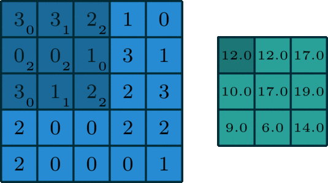

:toc:

# Convolution

= Česká dokumentace 

Plugin provádějící konvoluci - přesněji operace: zaostření (Gaussovo), rozostření, rozmazání, pixelizace. (podle zadaní Konvoluce 2)

image:img/gallery.png[width=1000]

### Specifikace pluginu
* Python plugin pro GIMP 2.8.22 (poslední verze GIMP v balíčkovém manažeru Ubuntu 18.04)
* Plugin obsahuje grafické rozhraní s parametrizovatenelnými filtry nebo umožňuje uživateli zadat vlastní jádro ve formě Python listu
* Pracuje se soubory s kanály GRAY*, RGB*
* Filtruje za pomocí Python modolů OpenCV a Numpy, které úpravu obrázku provádí efektivně jak časově, tak paměťově.

## Uživatelská dokumentace

### Instalace pro Linux (Ubuntu 18.04)

1. Stáhnutí https://gitlab.fit.cvut.cz/BI-PGA/b211/ngohongs/blob/master/2D/convolution.py[zdrojového kódu^], příp. stažení https://gitlab.fit.cvut.cz/BI-PGA/b211/ngohongs/blob/master/2D/noninteractive.scm[skriptu^] pro spuštění v příkazové řádce.

2. Verze 2.8.22 programu GIMP

    sudo apt install gimp

3. Instalace potřebných modulů OpenCV, Numpy

    sudo apt install python-numpy

    sudo apt install python-opencv

4. Udělení práv pro spouštění pluginu
   
    cd <adresář s pluginem>

    chmod +x convolution.py

5. Přesunutí souboru convolution.py do složky s GIMP pluginy (typicky ~/.gimp-2.8/plug-ins)

    cd <adresář s pluginem>

    cp convolution.py ~/.gimp-2.8/plug-ins/convolution.py

### Použití
1. Nainstalovat plugin podle popisu výše
2. Spustit GIMP
3. Vytvoření obrázku nebo načtení obrázku k úpravě
4. Spuštění pluginu lze skrze:

    - a) grafické rozhraní Gimpu, v horní liště Plugins > Convolution,
        - pamarametry: 
            - druh filtru
            - radius - síla efektu filtru nebo velikost jádra konvoluce (záleží na druhu filtru)
            - řešení hran při konvoluci: přesnější definice https://vovkos.github.io/doxyrest-showcase/opencv/sphinx_rtd_theme/enum_cv_BorderTypes.html
            - threshold - práh rozdílu Gaussova rozostření
            - vlastní jádro - ve formátu Python listu, např. [[0,0,0],[0,1,0],[0,0,0]]

    - b) nebo přes příkazovou řádku. Doporučuji si vytvořit scm skript, který vložíte do adresáře Gimp skriptů (typicky ~/.gimp-2.8/scripts)

    # obecný skript
    (define 
        (<název příkazu> filename [<název parametru pluginu>[<název parametru pluginu>...]]) 
            (let* ((image (car (gimp-file-load RUN-NONINTERACTIVE filename filename))) 
                    (drawable (car (gimp-image-get-active-layer image)))
                ) 
        (<název, pod kterým je váš plugin registrovaný (znaky '_' nahraďte znakem '-')> RUN-NONINTERACTIVE image drawable [<název parametru pluginu>[<název parametru pluginu>...]]) 
        (gimp-file-save RUN-NONINTERACTIVE image drawable filename filename) (gimp-image-delete image))
        )

    # noninteractive.scm
    (define (conv filename filter radius edge threshold kernel) (let* ((image (car (gimp-file-load RUN-NONINTERACTIVE filename filename))) (drawable (car (gimp-image-get-active-layer image)))) (convolution-plugin-main RUN-NONINTERACTIVE image drawable filter radius edge threshold kernel) (gimp-file-save RUN-NONINTERACTIVE image drawable filename filename) (gimp-image-delete image)))

    # obecné spuštění pluginu z příkazové řádky
    $ gimp -i --verbose -b '(<název příkazu> <cesta k obrázku v uvozovkách> [<hodnota 1. parametru pluginu>[<hodnota 2. parametru pluginu>...]])'

    # spuštění convolution.py z příkazové řádky 
    # v případě, že daná operace nevyuživá daný parameter, zadejte místo tohoto parametru jeho nejnižší možnou hodnotu, pro parametr vlastní jádro '[[0,0,0],[0,1,0],[0,0,0]]'
    # filtery:
    #   1 - rozmazání, 2 - Gaussovo rozostření, 3 - Gaussovo zaostření, 4 - zaostření, 5 - vlastní jádro
    # radius: 
    #   hodnoty: 1 - 1024
    # řešení hran obrázku:
    #   0 - REFLECT 101, 1 - REFLECT, 2 - REPLICATE, 3 - ISOLATE
    #   přesnější definice https://vovkos.github.io/doxyrest-showcase/opencv/sphinx_rtd_theme/enum_cv_BorderTypes.html
    # threshold:
    #   hodnoty: 1 - 255 (práh rozdílu Gaussova rozostření)
    # vlastní jádro:
    #   jádro napsané ve formě Python listu
    $ gimp -i --verbose -b '(conv <cesta k souboru v uvozovkách> <filter> <radius> <řešení hran obrázku> <threshold pro Gaussovo zaostření> <vlastní jádro v uvozovkách>)'

5. Zvolení operace a jeho parametrů
6. Potvrdit tlačítkem OK

image:img/menu.png[width=1000]

## Technická dokumentace

### Konvoluce
Konvoluce nad 2D obrázky je operace, která pro každý pixel obrázku bere v potaz jeho sousední pixely. Výsledkem konvoluce jedno pixelu je vážený průměr jeho sousedů.

image:img/conv1.gif[]

Vážený průměr je nad 2D obrázkem snado vypočítán pomocí konvolučního jádra. Jádrem postupně "překrýváme" jednotlivé pixely a každý prvek jádra vynásobíme hodnotou, kterou daný prvek jádra překryl. Výsledek pro daný pixel je pak suma všech pronásobených hodnot.

V případě RGB obrázků se jednotlivé kanály konvolují samostaně.

image:img/conv_rgb.png[]

image:img/conv_rgb1.gif[]

Zkonvoluvané kanály zpětně spojíme a dostáváme zkonvoluvaný RGB obrázek.

image:img/conv_rgb2.gif[]

### Řešení okrajů

Problém ale nastává, když se snažíme vypočítat vážený průměr na okraji obrázku, protože jádro překrývá prázdný prostor. 

Jak se má tento prostor vyplnit?

Prázdný prostor může být vyplněn např. těmito způsoby:

    * prázdnými pixely, vyplnit buňky nulami
    * okraje obrázku přezrcadlit na prázdnou stranu
    * krajní hodnoty obrázku opakovat

Všechny tyto možnosti má plugin naimplementované.

image:img/border.jpg[]

## Kód

### Funkce

#### convolve():

[source,python]
----
 def convolve(self, work_pixels):
        """
        Generic convolution filter

        accepts work_pixels in format of cv2 image numpy array
        """
        return cv2.filter2D(work_pixels, -1, self.kernel_param, borderType=self.edge_param)
----

Generická funkce na konvoluci vlastním jádrem.

#### box_blur():

[source,python]
----
def box_blur(self, work_pixels):
        """
        Box blur filter 

        average from the square (2 * int(self.radius_param) + 1) x (2 * int(self.radius_param) + 1)
        """
        s = 2 * int(self.radius_param) + 1
        self.kernel_param = np.ones((s,s)) / (s * s)
        return self.convolve(work_pixels)
----

Pro každý pixel vypočítá průměr jeho okolí.

#### gaussian_blur():

[source,python]
----
def gaussian_blur(self, work_pixels):
        """
        Gaussian blur 

        blurs work_image (image in cv2 format numpy array) with gaussian kernel with size (2 * int(self.radius_param) + 1)
        """
        s = 2 * int(self.radius_param) + 1
        return cv2.GaussianBlur(work_pixels, (s, s), 0, borderType=self.edge_param)
----

Provádí Gaussovo rozostření.

#### gaussian_sharpen():

[source,python]
----
def gaussian_sharpen(self, work_pixels):
        """
        Gaussian sharpen

        inspired by https://www.websupergoo.com/helpie/default.htm?page=source%2F2-effects%2Funsharpmask.htm

        sharpens the image by adding the difference of the original image and gaussian blurred image only when the difference exceeds the threshold  
        """
        blur = self.gaussian_blur(np.copy(work_pixels)).astype(np.uint8)
        shape = work_pixels.shape
        for x in range(shape[0]):
            for y in range(shape[1]):
                for z in range(shape[2]):
                    if clamp(int(work_pixels[x,y,z]) - int(blur[x,y,z]), 0, 255) > self.threshold_param:
                        work_pixels[x,y,z] = clamp(2 * int(work_pixels[x,y,z]) - int(blur[x,y,z]), 0, 255)
        return work_pixels
----

Provádí Gaussovské zaostření. Nejprve vypočítá Gaussovo rozostření a následně ho porovnává s originálním obrázkem. V případě, že rozdíl překročí určitý práh, přičte rozdíl mezi hodnotou pixelu Gaussova rozostření a originálu. 

#### sharpen():

[source,python]
----
def sharpen(self, work_pixels):
        """
        Sharpen 

        sharpens the image by adding edge detected image self.radius_param times
        """

        identity = np.array([[0,0,0],[0,1,0],[0,0,0]])
        edge_detection = np.array([[0,-1,0],[-1,4,-1],[0,-1,0]])
        self.kernel_param = identity + self.radius_param * edge_detection
        return self.convolve(work_pixels)
----

Provádí zaostření pomocí detekování hran jádrem stem:[[[0,-1,0\],[-1,4,-1\],[0,-1,0\]\]]. Násobek výsledku detekce hran následně přičte k originálu.

#### pixalate():

[source,python]
----
def pixelate(self, work_pixels):
        """
        Pixelation

        pixelates the image by resizing the original image down to (imageSize / self.radius_param) with linear interpolation
        and then rescale it back to the original size with nearest interpolation
        """
        shape = work_pixels.shape
        nw = int(shape[1] / self.radius_param)
        nh = int(shape[0] / self.radius_param)
        temp = cv2.resize(work_pixels, (nw, nh), interpolation=cv2.INTER_LINEAR)
        return cv2.resize(temp, (shape[1], shape[0]), interpolation=cv2.INTER_NEAREST)
----

Provádí pixelizaci pomocí zmenšení obrázku a následném zvětšení. Obrázek se nejprve zmenší pomocí lineární interpolace a následně zvětší pomocí interpolace nejbližšího pixelu.

#### create_dialog():

[source,python]
----
def create_dialog(self):
        self.dialog = gimpui.Dialog("Convolution", "covolution_dialog")

        self.table = gtk.Table(6, 7, False)
        self.table.set_row_spacings(8)
        self.table.set_col_spacings(8)
        self.table.show()

        # arrange horizontally
        self.dialog.vbox.hbox1 = gtk.HBox(True, 0)
        self.dialog.vbox.hbox1.show()
        self.dialog.vbox.pack_start(self.dialog.vbox.hbox1, False, False, 0)
        self.dialog.vbox.hbox1.pack_start(self.table, True, True, 0)

        # filter label
        self.label_filter = gtk.Label("Filter:")
        self.label_filter.show()
        self.table.attach(self.label_filter, 1, 2, 1, 2)

        # radius label
        self.label_radius = gtk.Label("Radius:")
        self.label_radius.show()
        self.table.attach(self.label_radius, 1, 2, 2, 3)

        # radius spin button
        self.radius_adj = gtk.Adjustment(1.0, 1.0, 1024.0, 1.0, 5.0, 0.0)
        self.radius_spin = gtk.SpinButton(self.radius_adj, 0, 0)
        self.radius_spin.set_wrap(True)
        self.radius_spin.show()
        self.table.attach(self.radius_spin, 2, 3, 2, 3)

        # threshold label
        self.label_thres = gtk.Label("Threshold:")
        self.label_thres.show()
        self.table.attach(self.label_thres, 1, 2, 6, 7)

        # threshold level
        self.threshold_adj = gtk.Adjustment(1.0, 0.0, 255.0, 1.0, 1.0, 0)
        self.threshold = gtk.HScale(self.threshold_adj)
        self.threshold.set_digits(0)
        self.threshold.set_value(1)
        self.threshold.show()
        self.table.attach(self.threshold, 2, 3, 6, 7)
        
        # custom kernel label
        self.label_custom = gtk.Label("Custom kernel:")
        self.label_custom.show()
        self.table.attach(self.label_custom, 1, 2, 7, 8)

        # custom kernel
        self.textbox = gtk.Entry()
        self.textbox.show()
        self.table.attach(self.textbox, 2, 3, 7, 8)

        # edge handling
        self.label_edge = gtk.Label("Edge handling:")
        self.label_edge.show()
        self.table.attach(self.label_edge, 1, 2, 4, 5)

        # drop down menu for choice of edge handling
        self.combobox_edge = gtk.combo_box_new_text()
        self.combobox_edge.append_text("Reflect 101")
        self.combobox_edge.append_text("Replicate")
        self.combobox_edge.append_text("Reflect")
        self.combobox_edge.append_text("Isolated")
        self.combobox_edge.connect("changed", self.edge_select)
        self.combobox_edge.set_entry_text_column(0)
        self.combobox_edge.set_active(0)
        self.combobox_edge.show()
        self.table.attach(self.combobox_edge, 2, 3, 4, 5)

        # drop down menu for choice of filters
        self.combobox_filter = gtk.combo_box_new_text()
        self.combobox_filter.append_text("Box Blur")
        self.combobox_filter.append_text("Gaussian Blur")
        self.combobox_filter.append_text("Gaussian Sharpen")
        self.combobox_filter.append_text("Sharpen")
        self.combobox_filter.append_text("Pixelate")
        self.combobox_filter.append_text("Custom kernel")
        self.combobox_filter.connect("changed", self.filter_select)
        self.combobox_filter.set_entry_text_column(0)
        self.combobox_filter.set_active(0)
        self.combobox_filter.show()
        self.table.attach(self.combobox_filter, 2, 3, 1, 2)

        # dialog buttons
        self.cancel_button = self.dialog.add_button(gtk.STOCK_CANCEL, gtk.RESPONSE_CANCEL)
        self.ok_button = self.dialog.add_button(gtk.STOCK_OK, gtk.RESPONSE_OK)
        self.ok_button.connect("clicked", self.ok_clicked)
----

Vytváří dialog pro zvolení parametrů.

## Zdroje

* Konvoluce : https://omdena.com/blog/applying-cnns/
* Konvoluce - animované : https://towardsdatascience.com/intuitively-understanding-convolutions-for-deep-learning-1f6f42faee1
* Řešení okrajů : http://www.bim-times.com/opencv/3.3.0/d3/df2/tutorial_py_basic_ops.html

= English Documentation

Plugin performing convolution – specifically operations: sharpening (Gaussian), blurring, smoothing, pixelation. (as per assignment Convolution 2)

image:img/gallery.png[width=1000]

### Plugin Specification
* Python plugin for GIMP 2.8.22 (latest GIMP version in Ubuntu 18.04 package manager)
* Plugin contains a graphical interface with parameterizable filters or allows the user to input a custom kernel as a Python list
* Works with files with GRAY*, RGB* channels
* Uses Python modules OpenCV and Numpy to efficiently process images in terms of time and memory

## User Documentation

### Installation for Linux (Ubuntu 18.04)

1. Download the https://gitlab.fit.cvut.cz/BI-PGA/b211/ngohongs/blob/master/2D/convolution.py[source code^], or optionally download the https://gitlab.fit.cvut.cz/BI-PGA/b211/ngohongs/blob/master/2D/noninteractive.scm[script^] for command-line execution.

2. Install GIMP version 2.8.22

    sudo apt install gimp

3. Install required modules OpenCV, Numpy

    sudo apt install python-numpy

    sudo apt install python-opencv

4. Grant execution rights to the plugin
   
    cd <plugin directory>

    chmod +x convolution.py

5. Move the file convolution.py to the GIMP plugins folder (typically ~/.gimp-2.8/plug-ins)

    cd <plugin directory>

    cp convolution.py ~/.gimp-2.8/plug-ins/convolution.py

### Usage
1. Install the plugin as described above
2. Start GIMP
3. Create or open an image to edit
4. Launch the plugin via:

    - a) the GIMP graphical interface, from the top menu Plugins > Convolution,
        - parameters: 
            - filter type
            - radius – filter effect strength or kernel size (depends on filter type)
            - edge handling during convolution: precise definition at https://vovkos.github.io/doxyrest-showcase/opencv/sphinx_rtd_theme/enum_cv_BorderTypes.html
            - threshold – Gaussian sharpening difference threshold
            - custom kernel – in Python list format, e.g., [[0,0,0],[0,1,0],[0,0,0]]

    - b) or via command line. It is recommended to create an scm script and place it into the GIMP scripts folder (typically ~/.gimp-2.8/scripts)

    # generic script
    (define 
        (<command name> filename [<plugin parameter>[<plugin parameter>...]]) 
            (let* ((image (car (gimp-file-load RUN-NONINTERACTIVE filename filename))) 
                    (drawable (car (gimp-image-get-active-layer image)))
                ) 
        (<name under which your plugin is registered (replace '_' with '-')> RUN-NONINTERACTIVE image drawable [<plugin parameter>[<plugin parameter>...]]) 
        (gimp-file-save RUN-NONINTERACTIVE image drawable filename filename) (gimp-image-delete image))
        )

    # noninteractive.scm
    (define (conv filename filter radius edge threshold kernel) (let* ((image (car (gimp-file-load RUN-NONINTERACTIVE filename filename))) (drawable (car (gimp-image-get-active-layer image)))) (convolution-plugin-main RUN-NONINTERACTIVE image drawable filter radius edge threshold kernel) (gimp-file-save RUN-NONINTERACTIVE image drawable filename filename) (gimp-image-delete image)))

    # general plugin run from CLI
    $ gimp -i --verbose -b '(<command> <image path in quotes> [<plugin param 1>[<plugin param 2>...]])'

    # run convolution.py from CLI
    # if a parameter is unused for an operation, provide the minimal acceptable value. For custom kernel, provide e.g., '[[0,0,0],[0,1,0],[0,0,0]]'
    # filters:
    #   1 - blur, 2 - Gaussian blur, 3 - Gaussian sharpen, 4 - sharpen, 5 - custom kernel
    # radius: 
    #   values: 1 - 1024
    # edge handling:
    #   0 - REFLECT 101, 1 - REFLECT, 2 - REPLICATE, 3 - ISOLATE
    #   detailed at: https://vovkos.github.io/doxyrest-showcase/opencv/sphinx_rtd_theme/enum_cv_BorderTypes.html
    # threshold:
    #   values: 1 - 255 (Gaussian sharpening difference threshold)
    # custom kernel:
    #   kernel in Python list format
    $ gimp -i --verbose -b '(conv <file path in quotes> <filter> <radius> <edge handling> <threshold> <custom kernel in quotes>)'

5. Choose the operation and its parameters
6. Confirm with the OK button

image:img/menu.png[width=1000]

## Technical Documentation

### Convolution
Convolution over 2D images is an operation that considers neighboring pixels for each image pixel. The result of a convolution of one pixel is a weighted average of its neighbors.

image:img/conv1.gif[]

The weighted average is easily calculated over a 2D image using a convolution kernel. The kernel is slid across the image; each kernel element is multiplied with the pixel it covers. The final pixel value is the sum of all such multiplications.

For RGB images, each channel is convolved separately.

image:img/conv_rgb.png[]

image:img/conv_rgb1.gif[]

Then the convolved channels are merged back together to produce the final RGB result.

image:img/conv_rgb2.gif[]

### Edge Handling

An issue arises at the image edges, where the kernel overlaps "empty" space.

How should this space be filled?

Options include:

    * fill with empty pixels (zeros)
    * mirror the image edges onto the empty side
    * repeat the edge pixel values

All of these options are implemented in the plugin.

image:img/border.jpg[]

## Code

### Functions

#### convolve():

[source,python]
----
 def convolve(self, work_pixels):
        """
        Generic convolution filter

        accepts work_pixels in format of cv2 image numpy array
        """
        return cv2.filter2D(work_pixels, -1, self.kernel_param, borderType=self.edge_param)
----

Generic convolution with a custom kernel.

#### box_blur():

[source,python]
----
def box_blur(self, work_pixels):
        """
        Box blur filter 

        average from the square (2 * int(self.radius_param) + 1) x (2 * int(self.radius_param) + 1)
        """
        s = 2 * int(self.radius_param) + 1
        self.kernel_param = np.ones((s,s)) / (s * s)
        return self.convolve(work_pixels)
----

Averages each pixel’s surroundings.

#### gaussian_blur():

[source,python]
----
def gaussian_blur(self, work_pixels):
        """
        Gaussian blur 

        blurs work_image (image in cv2 format numpy array) with gaussian kernel with size (2 * int(self.radius_param) + 1)
        """
        s = 2 * int(self.radius_param) + 1
        return cv2.GaussianBlur(work_pixels, (s, s), 0, borderType=self.edge_param)
----

Performs Gaussian blurring.

#### gaussian_sharpen():

[source,python]
----
def gaussian_sharpen(self, work_pixels):
        """
        Gaussian sharpen

        inspired by https://www.websupergoo.com/helpie/default.htm?page=source%2F2-effects%2Funsharpmask.htm

        sharpens the image by adding the difference of the original image and gaussian blurred image only when the difference exceeds the threshold  
        """
        blur = self.gaussian_blur(np.copy(work_pixels)).astype(np.uint8)
        shape = work_pixels.shape
        for x in range(shape[0]):
            for y in range(shape[1]):
                for z in range(shape[2]):
                    if clamp(int(work_pixels[x,y,z]) - int(blur[x,y,z]), 0, 255) > self.threshold_param:
                        work_pixels[x,y,z] = clamp(2 * int(work_pixels[x,y,z]) - int(blur[x,y,z]), 0, 255)
        return work_pixels
----

Performs Gaussian sharpening by comparing the original with its blurred version and enhancing contrast if the difference exceeds a threshold.

#### sharpen():

[source,python]
----
def sharpen(self, work_pixels):
        """
        Sharpen 

        sharpens the image by adding edge detected image self.radius_param times
        """

        identity = np.array([[0,0,0],[0,1,0],[0,0,0]])
        edge_detection = np.array([[0,-1,0],[-1,4,-1],[0,-1,0]])
        self.kernel_param = identity + self.radius_param * edge_detection
        return self.convolve(work_pixels)
----

Sharpens using an edge detection kernel and amplifies edge response by a factor of `radius_param`.

#### pixelate():

[source,python]
----
def pixelate(self, work_pixels):
        """
        Pixelation

        pixelates the image by resizing the original image down to (imageSize / self.radius_param) with linear interpolation
        and then rescale it back to the original size with nearest interpolation
        """
        shape = work_pixels.shape
        nw = int(shape[1] / self.radius_param)
        nh = int(shape[0] / self.radius_param)
        temp = cv2.resize(work_pixels, (nw, nh), interpolation=cv2.INTER_LINEAR)
        return cv2.resize(temp, (shape[1], shape[0]), interpolation=cv2.INTER_NEAREST)
----

Performs pixelation by downscaling with linear interpolation and upscaling with nearest-neighbor.

#### create_dialog():

(unchanged from original – GUI elements with GTK)

## Sources

* Convolution: https://omdena.com/blog/applying-cnns/
* Animated convolution: https://towardsdatascience.com/intuitively-understanding-convolutions-for-deep-learning-1f6f42faee1
* Edge handling: http://www.bim-times.com/opencv/3.3.0/d3/df2/tutorial_py_basic_ops.html
