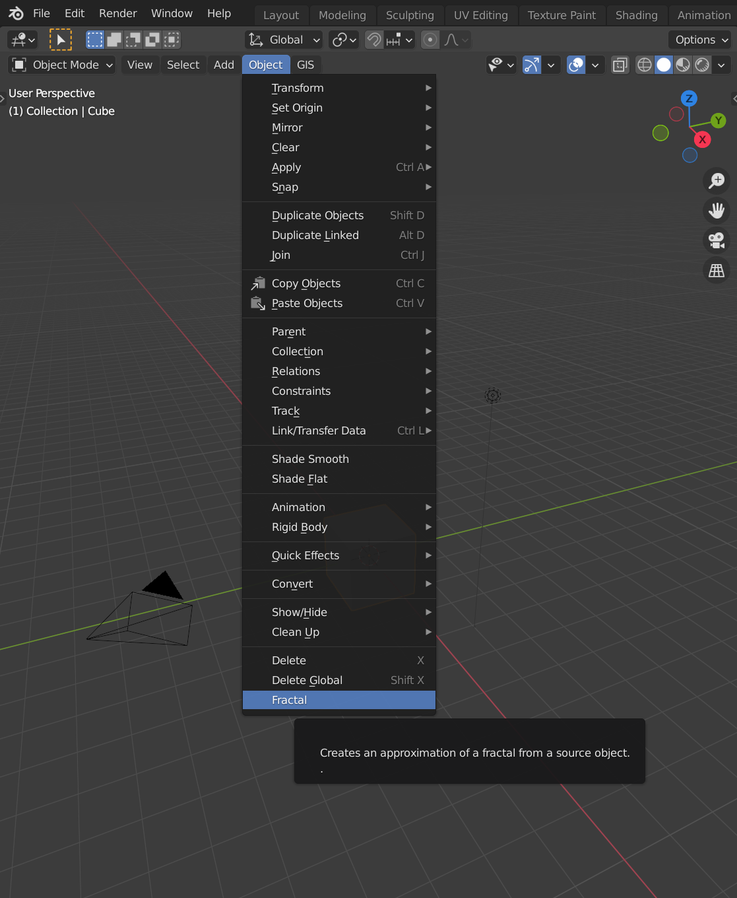
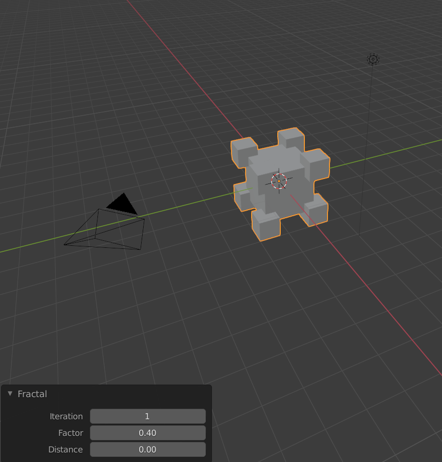
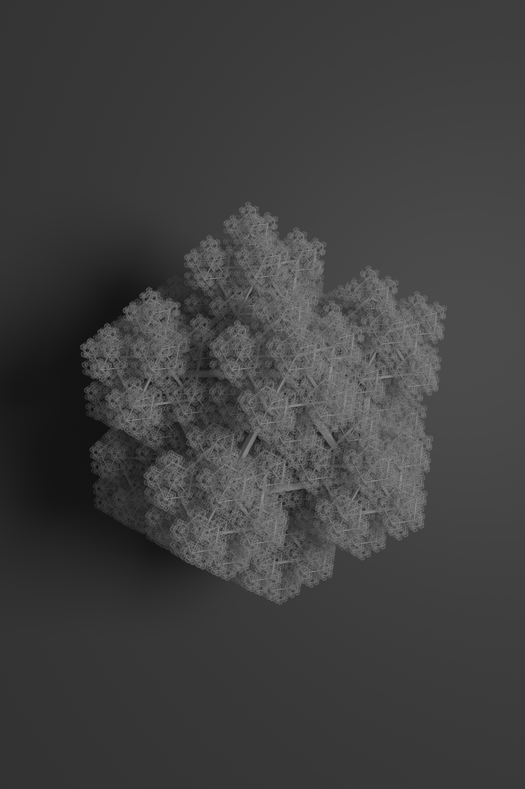

:toc:

# Fraktály
Plugin vytvářející fraktální objekty.

= Česká dokumentace

### Specifikace pluginu
* Blender 2.93.5

## Uživatelská dokumentace

### Instalace
1. Stáhnutí https://gitlab.fit.cvut.cz/BI-PGA/b211/ngohongs/blob/master/3D/fractal.py[zdrojového kódu^]
2. Instalace pluginu do Blendru:

    2a) Buď skrze nastavení Blendru (horní lišta Blendru):
        Edit > Prefrences... > Add-ons > Install... > vybrání souboru fractal.py > po instalaci se musí Fractal add-on povolit,
    
    2b) nebo otevřením Scripting okna > otevření souboru (tlačítko Open) > vybrání souboru fractal.py > spustění scriptu (tlačítkem Play) 

### Použití
1. Nainstalovat plugin podle popisu výše
2. Spuštění Blenderu
3. Přepnutí do Object modu
4. Vybrání jednoho modelu k fraktalizaci
5. V liště Layout okna: Object > Fractal

6. V levém dolním rohu zvolit možné parametry:
    * Iteration - hloubka rekurze
    * Factor - faktor zmenšení oproti objektu z minulé iterace
    * Distance - vzdálenost od objektu z minulé iterace

TIP: Nejlepší výsledky mají pravidelné objekty.

WARNING: U objektů s větším počtem vrcholů nedoporučuji jít přes hranici hloubky rekurze 3 nebo 4.

## Technická dokumentace
* Fraktály jsou nekonečné vzory, které jsou na jakémkoliv měřítku soběpodobné. Soběpodoné objekty jsou objekty, jejíž části jsou v jakémkoliv měřítku podobné. Z toho důvodu lze na nich pozorovat motivy, které se neustále opakují.

* Inspirace z https://www.youtube.com/watch?v=gnsUo96tIy0[YouTube videa^], ve kterém autor použivá ke generování fraktálů Geometry Nodes.

* Plugin https://gitlab.fit.cvut.cz/BI-PGA/b211/ngohongs/blob/master/3D/fractal.py[fractal.py^] generuje fraktály opakováním zdrojového modelu a umisťuje je v okolí jeho vrcholů. Kvůli způsobu generování jsou nejhezčí fraktály generovány hlavně z pravidelných objektů.

### Funkce 

#### fractalize(): 

[source, python]
----
def fractalize(self):
        new_objs = []
        
        print('Fractalizing...0%')
        for i in range(self.iteration): 
            for src_obj in self.src_objs:
                src_loc = src_obj.location
                
                mesh = src_obj.data
                vertices = mesh.vertices
                verts_world = (src_obj.matrix_world @ v.co for v in vertices.values())
                
                for coord in verts_world:
                    cpy_obj = src_obj.copy()
                    cpy_obj.data = src_obj.data.copy()
                    cpy_obj.location = coord + self.distance * (coord - src_loc)
                    cpy_obj.scale = self.factor * src_obj.scale
                    self.collection.objects.link(cpy_obj)
                    new_objs.append(cpy_obj)
            
                src_obj.select_set(False) 
                
            bpy.context.view_layer.update()
            self.src_objs = self.context.selected_objects
            print('Fractalizing...' + '%.1f%%' % (100 * float(i + 1)/self.iteration)) 
----

    ** Prochází jednotlivé zdrojové objekty. U každého si poznamená souřadnice jeho vrcholů. Na souřadnicích vrcholů, příp. posunutý o násobek vektoru směřující od středu zdrojového objektu k současnému vrcholu, vytvoří kopii zdrojového objektu s měřítkem zmenšený faktorem. Nově vygenerované objekty si uloží, kdyby se generovalo v příští iteraci.  V případě, že funkce nenarazila na horní limit hloubky rekurze, funkce se opakuje.

#### join_objects():

[source, python]
----
def join_objects(self):
        print('Fractalizing...joining')
        
        bpy.ops.object.select_all(action='DESELECT')
        
        self.orig_obj.select_set(True)
        for obj in self.collection.all_objects:
            obj.select_set(True)
    
        self.context.view_layer.objects.active = self.orig_obj
        bpy.ops.object.join()
        
        self.context.scene.collection.children.unlink(self.collection)
----

    ** Plugin nově vygenerované objekty ukladá do pomocné kolekce. Po vygenerování všech objektů poslední iterace funkce spojí všechny vygenerované meshe ke zdrojovému objektu.

## Rendery upravených fraktálů

TIP: Fraktál s hloubkoum rekurze 4 a zdrojovým modelem Icosphere s přidaným modifikátorem Wireframe. https://gitlab.fit.cvut.cz/BI-PGA/b211/ngohongs/blob/master/3D/projects/wireframe_icosphere.blend[Blender projekt^]

image:img/color_wireframe_icosphere.png[]

TIP: Fraktál s hloubkoum rekurze 4 a zdrojovým modelem Icosphere s přidaným modifikátorem Wireframe a vlastním shaderem. https://gitlab.fit.cvut.cz/BI-PGA/b211/ngohongs/blob/master/3D/projects/color_wireframe_icosphere.blend[Blender projekt^]

image:img/cube.png[]

TIP: Fraktál krychle s hloubkoum rekurze 4, faktorem 0.5 a vzdáleností 0.5. https://gitlab.fit.cvut.cz/BI-PGA/b211/ngohongs/blob/master/3D/projects/cube.blend[Blender projekt^]

image:img/tetrahedron.png[]

TIP: Fraktál čtyřstěnu s hloubkou rekurze 6 a zvýšenou velikostí. https://gitlab.fit.cvut.cz/BI-PGA/b211/ngohongs/blob/master/3D/projects/tetrahedron.blend[Blender projekt^]

= English documentation
A plugin for creating fractal objects.

=== Plugin Specifications
* Blender 2.93.5

== User Documentation

=== Installation
1. Download the https://gitlab.fit.cvut.cz/BI-PGA/b211/ngohongs/blob/master/3D/fractal.py[source code^].
2. Install the plugin into Blender:

    2a) Either through Blender settings (top Blender menu):  
        `Edit > Preferences... > Add-ons > Install...` > select the `fractal.py` file > after installation, enable the Fractal add-on,  

    2b) Or open the Scripting window > open the file (Open button) > select `fractal.py` > run the script (Play button).

=== Usage
1. Install the plugin as described above.
2. Launch Blender.
3. Switch to Object mode.
4. Select a model to fractalize.
5. In the Layout window toolbar: `Object > Fractal`

6. In the bottom-left corner, choose the available parameters:
    * *Iteration* – depth of recursion
    * *Factor* – scale reduction compared to the previous iteration’s object
    * *Distance* – distance from the previous iteration’s object

TIP: Best results are achieved with regular objects.

WARNING: For objects with many vertices, do not exceed recursion depth of 3 or 4.

== Technical Documentation

* Fractals are infinite patterns that are self-similar at any scale. Self-similar objects are those whose parts resemble the whole at any level of zoom. Thus, repetitive motifs can be observed throughout.

* Inspired by https://www.youtube.com/watch?v=gnsUo96tIy0[this YouTube video^], in which the author generates fractals using Geometry Nodes.

* The plugin https://gitlab.fit.cvut.cz/BI-PGA/b211/ngohongs/blob/master/3D/fractal.py[`fractal.py`^] generates fractals by duplicating a source model and placing the copies around the source’s vertices. Due to the generation method, the best results are achieved with regular objects.

=== Functions

==== `fractalize()`

[source,python]
----
def fractalize(self):
        new_objs = []
        
        print('Fractalizing...0%')
        for i in range(self.iteration): 
            for src_obj in self.src_objs:
                src_loc = src_obj.location
                
                mesh = src_obj.data
                vertices = mesh.vertices
                verts_world = (src_obj.matrix_world @ v.co for v in vertices.values())
                
                for coord in verts_world:
                    cpy_obj = src_obj.copy()
                    cpy_obj.data = src_obj.data.copy()
                    cpy_obj.location = coord + self.distance * (coord - src_loc)
                    cpy_obj.scale = self.factor * src_obj.scale
                    self.collection.objects.link(cpy_obj)
                    new_objs.append(cpy_obj)
            
                src_obj.select_set(False) 
                
            bpy.context.view_layer.update()
            self.src_objs = self.context.selected_objects
            print('Fractalizing...' + '%.1f%%' % (100 * float(i + 1)/self.iteration)) 
----

**Description:**  
Iterates over the source objects. For each one, it notes the vertex coordinates. At each vertex (optionally offset by a multiple of the vector from the object center to the vertex), it creates a scaled copy of the source object. The new objects are stored for use in the next iteration. If the recursion depth limit hasn’t been reached, the function continues recursively.

==== `join_objects()`

[source,python]
----
def join_objects(self):
        print('Fractalizing...joining')
        
        bpy.ops.object.select_all(action='DESELECT')
        
        self.orig_obj.select_set(True)
        for obj in self.collection.all_objects:
            obj.select_set(True)
    
        self.context.view_layer.objects.active = self.orig_obj
        bpy.ops.object.join()
        
        self.context.scene.collection.children.unlink(self.collection)
----

**Description:**  
The plugin stores newly generated objects in a helper collection. After the final iteration, this function joins all generated meshes with the original source object.

== Renders of Modified Fractals

TIP: Fractal with recursion depth 4 and an Icosphere as the source model with a Wireframe modifier.  
Blender project: https://gitlab.fit.cvut.cz/BI-PGA/b211/ngohongs/blob/master/3D/projects/wireframe_icosphere.blend[Download^]

image::img/color_wireframe_icosphere.png[]

TIP: Fractal with recursion depth 4, Icosphere source model, Wireframe modifier, and custom shader.  
Blender project: https://gitlab.fit.cvut.cz/BI-PGA/b211/ngohongs/blob/master/3D/projects/color_wireframe_icosphere.blend[Download^]

image::img/cube.png[]

TIP: Cube fractal with recursion depth 4, factor 0.5, and distance 0.5.  
Blender project: https://gitlab.fit.cvut.cz/BI-PGA/b211/ngohongs/blob/master/3D/projects/cube.blend[Download^]

image::img/tetrahedron.png[]

TIP: Tetrahedron fractal with recursion depth 6 and increased size.  
Blender project: https://gitlab.fit.cvut.cz/BI-PGA/b211/ngohongs/blob/master/3D/projects/tetrahedron.blend[Download^]
