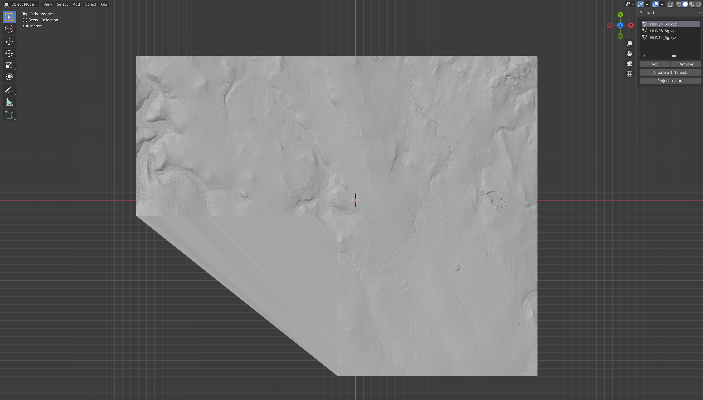
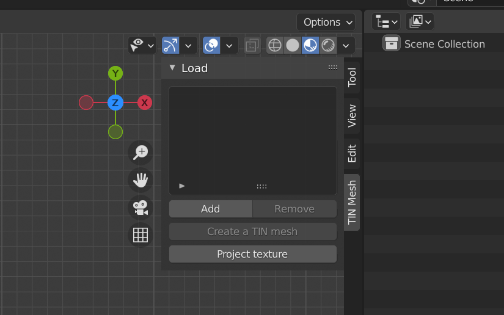
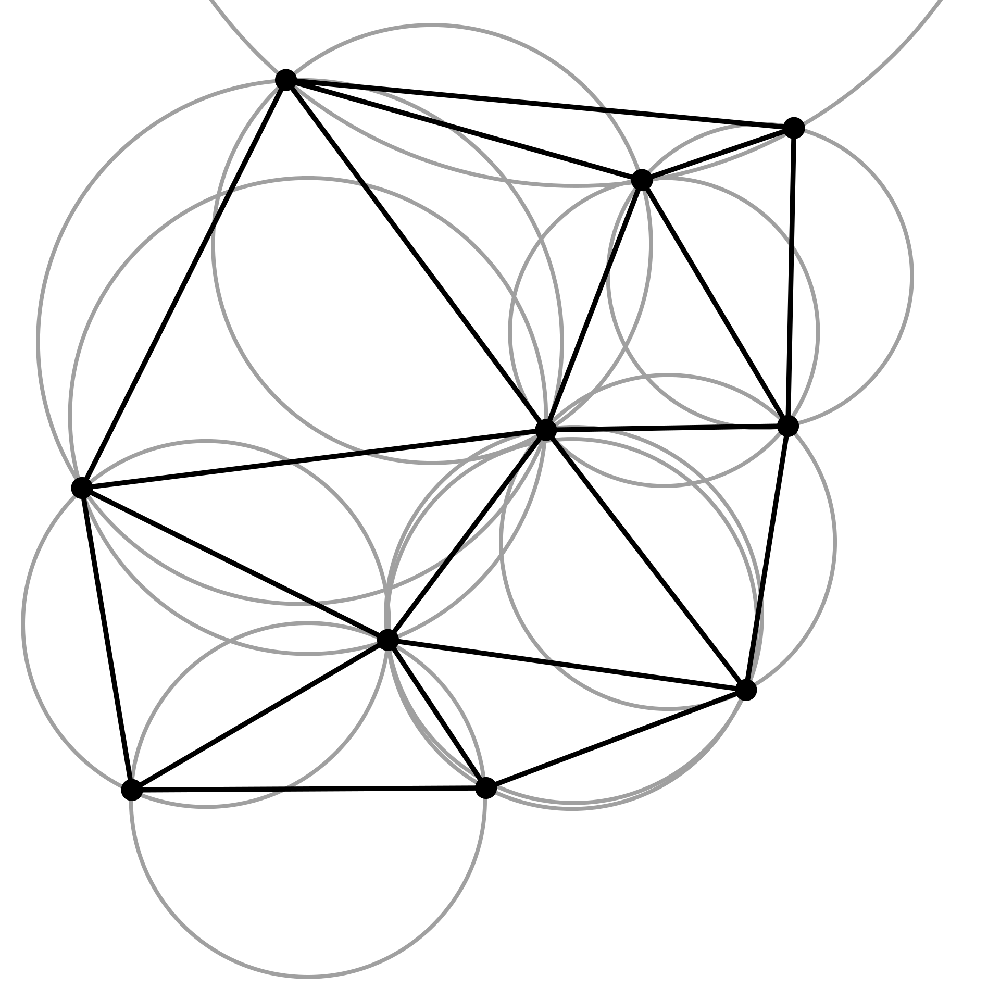
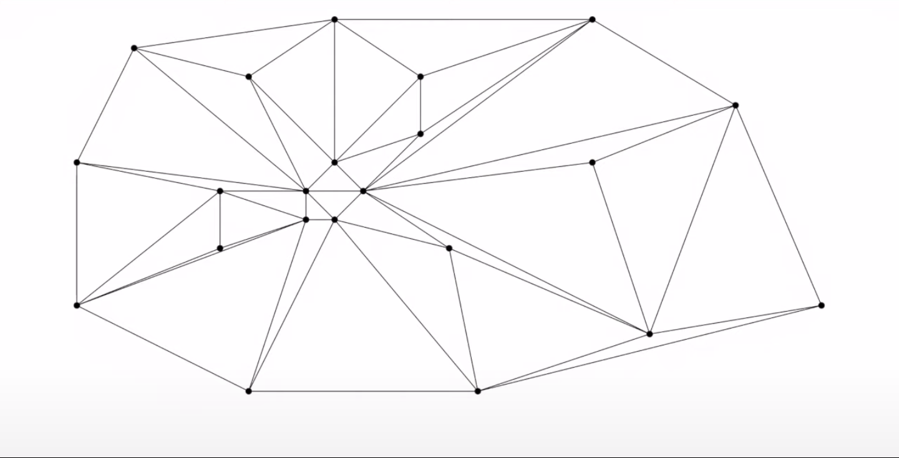
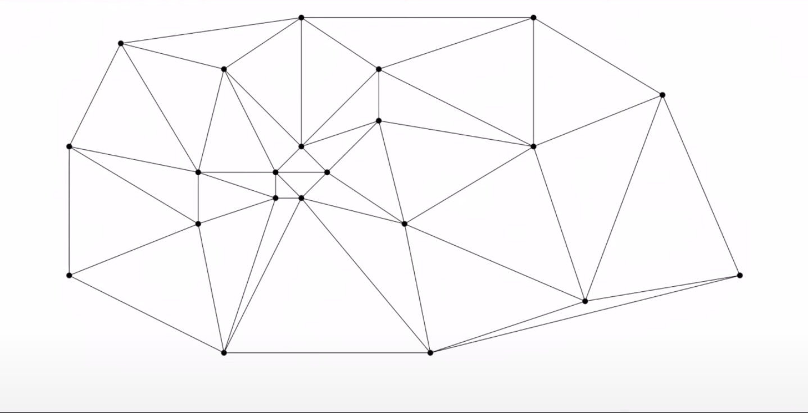

# DMR Loader (format .xyz)

- Blender Python script
- Imports mesh from TIN formatted files (*.xyz)
    - supports data from [cuzk.cz](https://geoportal.cuzk.cz/(S(bmwuekcj3fsfdpiqaitt3szr))/Default.aspx?mode=TextMeta&side=vyskopis&metadataID=CZ-CUZK-DMR5G-V&head_tab=sekce-02-gp&menu=302) portal, specifiacally DMR 5G
    - supports texture data from [cuzk.cz](https://geoportal.cuzk.cz/(S(43sxcz2hssixezdwcmqkulvy))/Default.aspx?mode=TextMeta&side=ortofoto&metadataID=CZ-CUZK-ORTOFOTO-R&productid=63410&mapid=83&menu=231)
    - other data samples were not tested

## Dependencies

- Blender 2.93.5
- [BlenderGIS](https://github.com/domlysz/BlenderGIS)

## User

### Installation

- Open `tin_load.py` script in Blender Scripting windows and run the script
- or open `Edit > Prefrences > Add-ons` menu and hit `Install` button to select `tin_load.py` script, plugin `TIN mesh (DMR 5G)` needs to be then enabled in `Add-ons` menu

### Usage

- Script can be run from Layout panel
    - With `Add` action user can add TIN files
    - `Remove` action removes selected TIN file from the list
    - Action `Create a TIN mesh` creates TIN mesh from TIN files in the list and centers it to the origin (After hitting `Create a TIN mesh`, Blender can freeze due to expensive triangulation)
    - Action `Project texture` projects a texture orthogonally onto the mesh.
        - To project texture onto mesh that consists of several data files texture needs to be connected into one texture in a bitmap editor such as GIMP or Photoshop in the same placement as the mesh data 
        - for example - Texture edit in GIMP of texture data HLIN04.jpg, HLIN05.jpg, HLIN14.jpg for mesh data HLIN04_5G.xyz, HLIN05_5G.xyz, HLIN14_5G.xyz:
            - Texture:
                 
            - for mesh in Blender:
                    
        

- Preview:




## Technical documentation

### Procedures

#### Object creation

- Files `.xyz`  contains data only about XYZ position of each vertices, however, it does not have any information about each faces and edges of the mesh. To connect each vertices to create mesh with faces the point cloud (mesh containing only vertices) must be run through some kind of triangulation. In GIS systems the usual choice is Delaunay trigolation.

**Delaunay triangulation**



Delaunay triangulation is for set of P points is a triangulation such that every point of the set P is not inside of any triangle created by the triangulation. Delaunay triangulation is beneficial for terrain modeling due to the fact that it is maximazing the inner angles of each triangles. This feature is good for topology of the model and is avoiding "slim and skinny" triangels.

Example of generic triangulation:




Delaunay triangulation of the same set of points as above:



Images taken from:

- https://www.youtube.com/watch?v=ysLCuqcyJZA&t=628s

- https://en.wikipedia.org/wiki/Delaunay_triangulation

**Algorithm**

There are several algorithms to construct Delaunay triangulations. Here I will describe one, Bowyer–Watson algorithm to be specific. It is an incremental algorithm. The process of Bowyer-Watson algorithm is as follows:

1. Find super-triangle of the set of points. Super-triangle is a triangle that encapsulates all points in the space. 
2. Create a mesh that has only the super-triangle.
3. Add one point from the set to the mesh
4. Check if the newly added point is in any circumcirle of any trinangle in the mesh

    - if yes divide the triangles that have the point inside of their circumcirle by connecting their vertices to the newly added point
    - if no repeat from the step 3.

5. Remove edges of the super-triangulation
6. Return Delaunay triangulation

Pseudocode from [Wikipedia](https://en.wikipedia.org/wiki/Bowyer%E2%80%93Watson_algorithm)
```
function BowyerWatson (pointList)
   // pointList is a set of coordinates defining the points to be triangulated
   triangulation := empty triangle mesh data structure
   add super-triangle to triangulation // must be large enough to completely contain all the points in pointList
   for each point in pointList do // add all the points one at a time to the triangulation
      badTriangles := empty set
      for each triangle in triangulation do // first find all the triangles that are no longer valid due to the insertion
         if point is inside circumcircle of triangle
            add triangle to badTriangles
      polygon := empty set
      for each triangle in badTriangles do // find the boundary of the polygonal hole
         for each edge in triangle do
            if edge is not shared by any other triangles in badTriangles
               add edge to polygon
      for each triangle in badTriangles do // remove them from the data structure
         remove triangle from triangulation
      for each edge in polygon do // re-triangulate the polygonal hole
         newTri := form a triangle from edge to point
         add newTri to triangulation
   for each triangle in triangulation // done inserting points, now clean up
      if triangle contains a vertex from original super-triangle
         remove triangle from triangulation
   return triangulation
```

Animated construction of Delaunay triangulation by Bowyer-Watson algorithm can be watched in [this YouTube video](https://youtu.be/GctAunEuHt4?t=75).

### Operators

#### class OBJECT_OT_TINMechCreate
- reads all files from TIN file list and saves its vertex data
- creates a point cloud object
- after the point cloud object is created, triangulates the object to retrieve plane
  - triangulation is done by [Delaunay triangulation](https://en.wikipedia.org/wiki/Delaunay_triangulation) implemented by BlenderGIS
- deletes point cloud object
- recenters the plane to the origin (needs to be done twice to be centered, else it is not fully centered, could be a bug on the side of Blender) 

```
class OBJECT_OT_TINMeshCreate(bpy.types.Operator):
    """
    Loads data in TIN format and creates a mesh from it.
    """                                
    
    bl_idname = "object.tin_mesh"        
    bl_label = "Create a TIN mesh"       
    bl_options = {'REGISTER', 'UNDO'} 
    
    @classmethod
    def poll(cls, context):
        return context.scene.tin_list
    
    def execute(self, context):
        if context.mode != 'OBJECT':
            bpy.ops.object.mode_set(mode = 'OBJECT') 
              
        vertices = []
        edges = []
        faces = []

        for file in context.scene.tin_list:
            abspath = file.abspath
            with open(abspath, 'r') as f:
                for line in f:
                    vertices += [tuple([float(x) for x in line.split()])]
                    
                    
        mesh = bpy.data.meshes.new('Mesh')
        mesh.from_pydata(vertices, edges, faces)
        mesh.update()  
        object = bpy.data.objects.new('Point cloud', mesh)
        bpy.context.collection.objects.link(object)     
        
        bpy.ops.object.select_all(action='DESELECT')
        object.select_set(True)
        bpy.ops.tesselation.delaunay()
        
        mesh = bpy.context.active_object
        
        bpy.ops.object.select_all(action='DESELECT')
        object.select_set(True)
        bpy.ops.object.delete() 
    

        bpy.ops.object.select_all(action='DESELECT')
        mesh.select_set(True)

        # Needs to be recentered twice else the object is not centered
        for i in range(2):
            bpy.ops.object.origin_set(type='ORIGIN_CENTER_OF_MASS', center='MEDIAN')
            bpy.context.object.location = [0, 0, 0]     
        
        return {'FINISHED'}         
```       

### UI

- heavily inspired by [this Blender panel UIList](https://sinestesia.co/blog/tutorials/using-uilists-in-blender/)

#### class TINFile

- represents a single item in the list 
- holds information about the filename and its absolute path for reading

```
class TINFile(bpy.types.PropertyGroup):
    """File representation in TIN List"""   
    filename : bpy.props.StringProperty(name= 'Filename')
        
    abspath : bpy.props.StringProperty(name= 'Absolute path')
```

#### class LIST_OT_ADDTINFile

- `Add` operator for adding new file(s) to the list
- Retrieves filenames and absolute path of the TIN files

```
class LIST_OT_AddTINFile(bpy.types.Operator, bpy_extras.io_utils.ImportHelper):
    """Add a new TIN file to the list."""

    bl_idname = "tin_list.add_file"
    bl_label = "Add new TIN file to TIN list"

    files: bpy.props.CollectionProperty(
            type=bpy.types.OperatorFileListElement,
            options={'HIDDEN', 'SKIP_SAVE'},
        )
        
    def execute(self, context):
        for file in self.files:
            dirname = os.path.dirname(self.filepath)
            filename = file.name
            abspath = os.path.join(dirname, filename)
            
            item = context.scene.tin_list.add()
            item.filename = filename
            item.abspath = abspath

        return{'FINISHED'}
```

#### class LIST_OT_RemoveTINFile

- Removes selected TIN file from the list
- `poll` functions invalidates `Remove` action if the list is empty
- fixes `tin_index` so that it points to the last object

```
class LIST_OT_RemoveTINFile(bpy.types.Operator):
    """Delete the selected item from the list."""

    bl_idname = "tin_list.remove_file"
    bl_label = "Remove selected TIN file"

    @classmethod
    def poll(cls, context):
        return context.scene.tin_list

    def execute(self, context):
        tin_list = context.scene.tin_list
        index = context.scene.tin_index

        tin_list.remove(index)
        context.scene.tin_index = min(max(0, index - 1), len(tin_list) - 1)

        return{'FINISHED'}
```
#### class LIST_UL_TINfileList

- list itself
- shows each item with its filename
  
```
class LIST_UL_TINFileList(bpy.types.UIList):
    """TIN List."""

    def draw_item(self, context, layout, data, item, icon, active_data, active_propname, index):

        custom_icon = 'MESH_DATA'

        if self.layout_type in {'DEFAULT', 'COMPACT'}:
            layout.label(text=item.filename, icon = custom_icon)

        elif self.layout_type in {'GRID'}:
            layout.alignment = 'CENTER'
            layout.label(text="", icon = custom_icon)
```

#### class OBJECT_PT_TINMeshPanel

- layout of the panel setup

```
class OBJECT_PT_TINMeshPanel(bpy.types.Panel):
    bl_space_type = 'VIEW_3D'
    bl_region_type = 'UI'
    bl_category = 'TIN Mesh'
    bl_label = 'Load'
    
    def draw(self, context):
        layout = self.layout
        scene = context.scene
        layout.template_list('LIST_UL_TINFileList', 'TINFileList', scene, 'tin_list', scene, 'tin_index')
        
        row = layout.row(align = True)
        row.operator("tin_list.add_file", text = 'Add')
        row.operator("tin_list.remove_file", text = 'Remove')
        
        row = layout.row(align = True)
        row.operator("object.tin_mesh")
        
        row = layout.row(align = True)
        row.operator("object.tin_tex")
```

#### class OBJECT_PT_ZTopUVMap(bpy.types.Operator)

- maps UV coordinates from XY coordinates of the mesh
- heavily inspired by: https://blender.stackexchange.com/questions/185496/how-to-unwrap-a-mesh-from-view-in-python-blender-2-8

```
class OBJECT_PT_ZTopUVMap(bpy.types.Operator):
    """
    Map UV coordinates from top view projection.
    """
    bl_idname = 'object.ztop_uvmap'      
    bl_label = 'Project UV from top view'       
    bl_options = {'REGISTER', 'UNDO'}
    
    def execute(self, context):
        import bmesh
        import numpy as np
        from mathutils import Matrix, Vector
        object = context.selected_objects[0]
        mesh = object.data
        bm = bmesh.new()
        bm.from_mesh(mesh)
        x, y, z = np.array([v.co for v in bm.verts]).T
        S = Matrix.Diagonal(
            ( 
                1 / (x.max() - x.min()),
                1 / (y.max() - y.min())
            )
          )
        print(x.min(), x.max(), y.min(), y.max(),S)
        uv_layer = bm.loops.layers.uv.verify()
        
        offset = Vector((0.0,0.0))
        if x.min() != 0.0:
            offset[0] = -x.min()
        if y.min() != 0.0:
            offset[1] = -y.min()
            
        for face in bm.faces:
            for loop in face.loops:
                loop_uv = loop[uv_layer]
                # use xy position of the vertex as a uv coordinate
                loop_uv.uv = S @ (loop.vert.co.xy + offset)
        bm.to_mesh(mesh)
        mesh.update()
        
        return {'FINISHED'}
```


#### class OBJECT_PT_TINTex(bpy.types.Operator, bpy_extras.io_utils.ImportHelper)

- operator that projects texture from top view +Z axis down.

```
class OBJECT_PT_TINTex(bpy.types.Operator, bpy_extras.io_utils.ImportHelper):
    """
    Apply texture from top view.
    """
    bl_idname = 'object.tin_tex'        
    bl_label = 'Project texture'       
    bl_options = {'REGISTER', 'UNDO'} 
    
    def execute(self, context):
        import mathutils
        import math
        if len(context.selected_objects) != 1:
            self.report({'WARNING'}, 'Select one TIN mesh')
            return {'CANCELLED'}
        if context.mode != 'OBJECT':
            bpy.ops.object.mode_set(mode='OBJECT')   
            
        object = context.selected_objects[0]
        abspath = self.properties.filepath
        
        bpy.ops.object.ztop_uvmap()
    
        mat = bpy.data.materials.new(name="Texture")
        mat.use_nodes = True
        nodes = mat.node_tree.nodes
        nodes.clear()

        node_principled = nodes.new(type='ShaderNodeBsdfPrincipled')
        node_principled.location = 0,0

        node_tex = nodes.new('ShaderNodeTexImage')
        node_tex.image = bpy.data.images.load(abspath)
        node_tex.location = -400,0

        node_output = nodes.new(type='ShaderNodeOutputMaterial')   
        node_output.location = 400,0

        links = mat.node_tree.links
        link = links.new(node_tex.outputs["Color"], node_principled.inputs["Base Color"])
        link = links.new(node_principled.outputs["BSDF"], node_output.inputs["Surface"])
        
        if object.data.materials:
            object.data.materials[0] = mat
        else:
            object.data.materials.append(mat)
        
        return {'FINISHED'}

```
